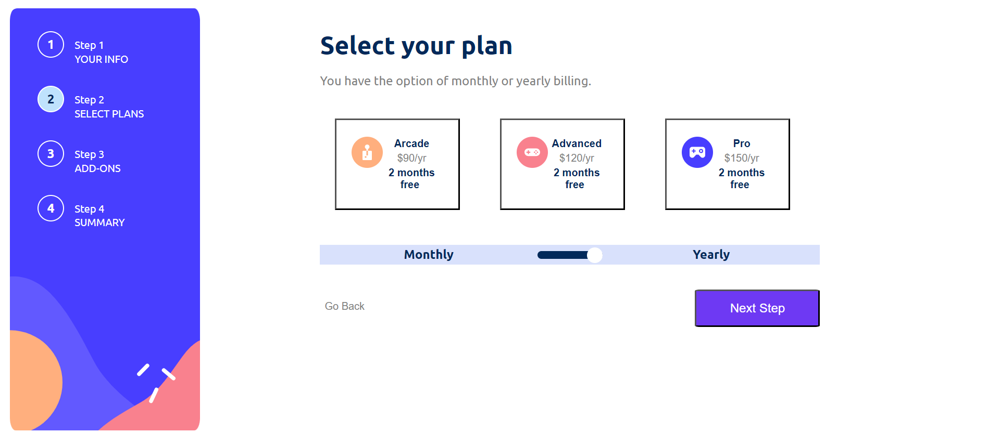

# 🚀Multi-Step Form - React [Frontend]🚀

This is a solution to the [Multi-step form challenge on Frontend Mentor](https://www.frontendmentor.io/challenges/multistep-form-YVAnSdqQBJ). Frontend Mentor challenges help you improve your coding skills by building realistic projects. 

## Table of contents

- [Overview](#overview)
  - [The challenge](#the-challenge)
  - [Screenshot](#screenshot)
  - [Links](#links)
- [My process](#my-process)
  - [Built with](#built-with)
  - [What I learned](#what-i-learned)
- [Author](#author)

## Overview

### The challenge

Users should be able to:

- Complete each step of the sequence
- Go back to a previous step to update their selections
- See a summary of their selections on the final step and confirm their order
- View the optimal layout for the interface depending on their device's screen size
- See hover and focus states for all interactive elements on the page
- Receive form validation messages if:
  - A field has been missed
  - The email address is not formatted correctly
  - A step is submitted, but no selection has been made

### Screenshot

### Links

- Solution URL: [Click Here](https://github.com/chayansurana3/P10-Multi-Step-Form.git)
- Live Site URL: [Click Here](https://chayansurana3.github.io/P10-Multi-Step-Form/)

### Built with

- [React](https://reactjs.org/) - JS library
- Semantic HTML5 markup
- CSS custom properties
- CSS Grid
- Mobile-first workflow

### What I learned

This was my first major project using React. I have learned about various React fundamentals (Hooks, states, components, props etc). This project has been a real confidence builder for me. 

## Author

- Frontend Mentor - [@chayansurana3](https://www.frontendmentor.io/profile/chayansurana3)
- Twitter - [@chayan_surana_](https://twitter.com/chayan_surana_)